class: middle, center, title-slide

# Distributed and Federated Learning

.bold.larger-x[Federated learning for healthcare data]

  
Yuriy Kochura 
Ivan Zhuk 
Yuri Gordienko

National Technical University of Ukraine “Igor Sikorsky Kyiv Polytechnic Institute”

    
.smaller-x[Project ID: 101123524]

---

# Us

This material is presented by:
- Theoretical lecture: .bold[Yuri Gordienko]
- Exercise session: .bold[Ivan Zhuk] and .bold[Yuriy Kochura]

Feel free to contact .bold[Yuriy Kochura] at [iuriy.kochura@gmail.com](mailto:iuriy.kochura@gmail.com) or on Telegram &mdash; <a href="https://t.me/y_kochura">@y_kochura</a> for assistance.

 

.grid[
.kol-1-3[ 
.circle.center.width-70[]
.bold.center[Yuriy Kochura]

]

.kol-1-3[ 
.circle.center.width-70[]
.bold.center[Ivan Zhuk]
  ]

.kol-1-3[
.circle.center.width-65[]
.bold.center[Yuri Gordienko]
]]

---

class:  black-slide, middle 
background-image: url(./figures/lec1/1726464736780.png)
background-size: cover

# Agenda

.larger-x[ 
 

🎙️ AI in Healthcare  
🎙️ Market Size & Trends   
🎙️ Federated Learning (FL) in Healthcare   
🎙️ Why we need FL?  
🎙️ How does FL work?  
🎙️ Data harmonization challenges for FL  
🎙️ Large-scale standardized dataset (MedMNIST)  
🎙️ Future directions for FL in Healthcare  

]

---

class: blue-slide, middle, center
count: false

.larger-xxx[AI in Healthcare]

---

class:  middle

# AI in medicine

.width-100[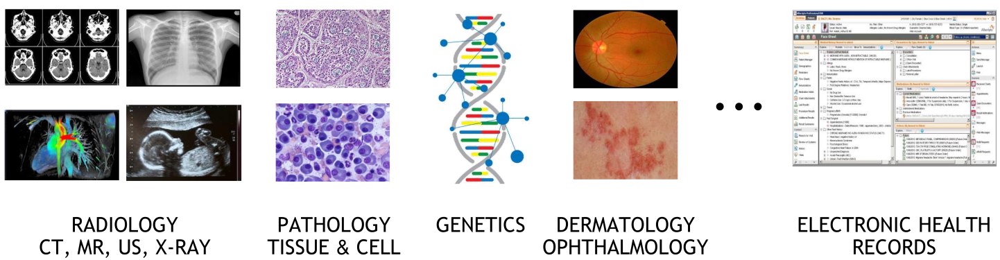]

  

 
<table style="width:500px; table-layout: fixed; border: 1px solid #000;">
  <thead>
    <tr>
      <th style="width: 100px;">Year</th>
      <th style="width: 200px;">FDA-Approved AI Tools</th>
      <th style="width: 200px;">Global Investment (USD)</th>
    </tr>
  </thead>
  <tbody>
    <tr>
      <td>2021</td>
      <td>~128</td>
      <td>~$7B</td>
    </tr>
    <tr>
      <td>2024</td>
      <td>~169</td>
      <td>~$26.57B</td>
    </tr>
  </tbody>
</table>

.footnote[Credit: [Artificial Intelligence and Machine Learning (AI/ML)-Enabled Medical Devices](https://www.fda.gov/medical-devices/software-medical-device-samd/artificial-intelligence-and-machine-learning-aiml-enabled-medical-devices). Nicola Rieke and Yuhong Wen - FEDERATED LEARNING FOR MEDICAL IMAGING.]

---

background-image: url(./figures/lec1/building-blocks.png)
background-size: contain

# From research ...
.center[## Improving state of the art performance in controlled settings]

.footnote[Credit: Nicola Rieke and Yuhong Wen - FEDERATED LEARNING FOR MEDICAL IMAGING.]

---

background-image: url(./figures/lec1/app-in-medicine.png)
background-size: contain

#  ... to applications
.center[## Achieving human-level performance on large data and clinical settings]

.footnote[Credit: Nicola Rieke and Yuhong Wen - FEDERATED LEARNING FOR MEDICAL IMAGING.]

---

class: middle, black-slide, center

<iframe width="600" height="450" src="https://www.youtube.com/embed/AbdVsi1VjQY" frameborder="0" allowfullscreen></iframe>

How AI is advancing medicine (Google, 2018)

---

class: middle,

.center.width-50[]

.center[Med-PaLM 2 (Google) is a large language model tuned for the medical domain. It reaches 85%+ accuracy on the MedQA medical exam benchmark in research.]

.footnote[Credit: Google Research, [Med-PaLM](https://sites.research.google/med-palm/), 2022.]

???
What makes these AI systems really different is that they offer a new interface. AI is no longer embedded in tools but in direct contact with us, humans.

For example, Med-PaLM 2 is a large language model tuned for the medical domain. It can be interacted with using natural language, as if you were talking to a medical expert. You do not need to know how to write code or how to define these mathematical models. You just ask a question, and it will give you an answer.

---

class: middle

## AlphaFold: From a sequence of amino acids to a 3D structure

.grid[
.kol-2-3.center.width-100[]
.kol-1-3.center.width-80[]
.kol-1-3.circle.center.width-80[ 
.smaller-x[[John Jumper](https://en.wikipedia.org/wiki/John_M._Jumper)]  
.smaller-xx[(The 2024 Nobel Prize in Chemistry)]]
.kol-1-4.circle.center.width-40[ ]

]

???

AlphaFold is a neural network based on the trasnformer architecture that can predict the 3D structure of a protein from its amino acid sequence.

This problem is important because the 3D structure of a protein determines its function, and understanding protein function is key to understanding biology and designing new drugs.

However, determining the 3D structure of a protein experimentally is difficult and expensive, taking up to months just to solve a single structure.

AlphaFold has been a breakthrough in this area, and has been able to predict the 3D structure of proteins with high accuracy, in just a couple of minutes for the longest sequences.

---

class: middle, black-slide, center

<iframe width="600" height="450" src="https://www.youtube.com/embed/gg7WjuFs8F4" frameborder="0" allowfullscreen></iframe>

AI for Science (Deepmind, AlphaFold, 2020)

---

class: middle

## Drug discovery with graph neural networks

.center.width-80[]

???

A second example is the use of graph neural networks to discover new drugs.

Discovering new drugs is a complex and expensive search problem, where the goal is to find molecules that will bind to a target protein and modulate its function. Unfortunately, this problem is difficult for two reasons:

  - first, the search space is huge -- the space all possible pharmacologically active molecules is estimated to be in the order of 10^60 molecules.
  - second, the binding of a molecule to a protein is a complex process that is difficult to model. Laboratory experiments are necessary to evaluate the binding of a molecule to a protein, and these experiments are expensive and time-consuming.

Graph neural networks have been a breakthrough in this area, and have been able to predict the properties of molecules with high accuracy.

In a sense, they can serve as a virtual laboratory that can be used to pre-screen millions of molecules in a matter of hours, thereby reducing the laboratory work to only the most promising candidates.

---

class: blue-slide, middle, center
count: false

.larger-xxx[Market Size & Trends]

---

class: black-slide, middle

<!-- background-image: url(./figures/lec1/ai-healthcare-market.png)
background-size: contain -->

.width-100[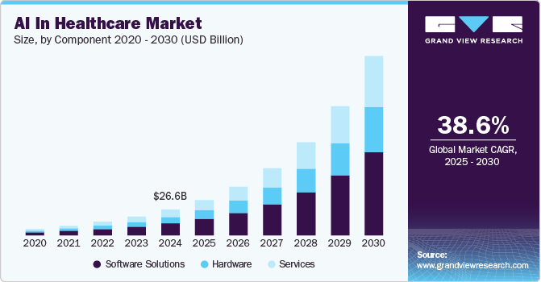]

.smaller-xx[.bold[CAGR] (Compound Annual Growth Rate)]

.alert[A .bold[key factor] driving market growth is the increasing demand in the healthcare sector for enhanced efficiency, accuracy, and better patient outcomes.]

.footnote[Credit: [AI In Healthcare Market Size, Share, And Trends Analysis Report By Component (Hardware, Services), By Application, By End Use, By Technology, By Region (North America, Europe, APAC, Latin America, MEA), And Segment Forecasts, 2025 - 2030](https://www.grandviewresearch.com/industry-analysis/artificial-intelligence-ai-healthcare-market).]

---

class: black-slide, middle

.width-100[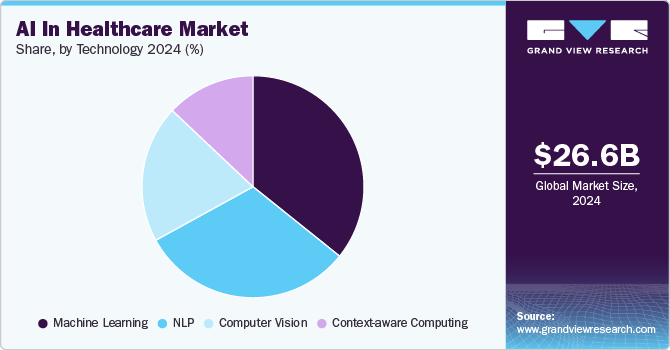]

.alert.smaller-x[The .bold[context-aware computing] segment is expected to grow at the fastest CAGR between 2025 and 2030. AI algorithms integrate and analyze diverse data sources such as electronic health records (EHRs), real-time vital signs, medical history, environmental factors, and patient activity to understand patient context dynamically.]

.footnote[Credit: [AI In Healthcare Market Size, Share, And Trends Analysis Report By Component (Hardware, Services), By Application, By End Use, By Technology, By Region (North America, Europe, APAC, Latin America, MEA), And Segment Forecasts, 2025 - 2030](https://www.grandviewresearch.com/industry-analysis/artificial-intelligence-ai-healthcare-market).]

---

class: black-slide, middle

.width-100[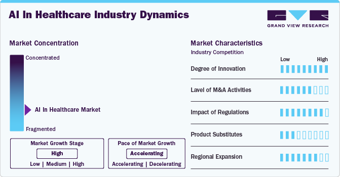]

.alert.smaller-x[The Healthcare AI market exhibits a high degree of innovation, characterized by ongoing advancements in technology. Rapid developments in machine learning, deep learning, natural language processing, and computer vision are driving the evolution of AI-powered healthcare solutions.]

.footnote[Credit: [AI In Healthcare Market Size, Share, And Trends Analysis Report By Component (Hardware, Services), By Application, By End Use, By Technology, By Region (North America, Europe, APAC, Latin America, MEA), And Segment Forecasts, 2025 - 2030](https://www.grandviewresearch.com/industry-analysis/artificial-intelligence-ai-healthcare-market).]

---

class: black-slide, middle

.width-100[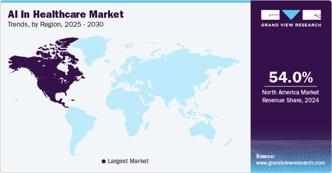]

.alert.smaller-x[North America AI in healthcare industry dominated the global market and accounted for the largest revenue share of over 54% in 2024. 

AI in healthcare industry in the UK held the largest market share in the European region in 2024.]

.footnote[Credit: [AI In Healthcare Market Size, Share, And Trends Analysis Report By Component (Hardware, Services), By Application, By End Use, By Technology, By Region (North America, Europe, APAC, Latin America, MEA), And Segment Forecasts, 2025 - 2030](https://www.grandviewresearch.com/industry-analysis/artificial-intelligence-ai-healthcare-market).]

---

class: middle

# Key Companies

The following are the .bold[leading companies] in the AI in healthcare market. These companies collectively hold the largest market share and dictate industry trends:

.grid[
.kol-1-2[
- Microsoft
- IBM
- Google
- NVIDIA Corporation
- Intel Corporation
- Itrex Group]
.kol-1-2[
- GE Healthcare
- Medtronic
- Oracle
- Medidata
- Merck
- IQVIA
]]

.footnote[Credit: [AI In Healthcare Market Size, Share, And Trends Analysis Report By Component (Hardware, Services), By Application, By End Use, By Technology, By Region (North America, Europe, APAC, Latin America, MEA), And Segment Forecasts, 2025 - 2030](https://www.grandviewresearch.com/industry-analysis/artificial-intelligence-ai-healthcare-market).]

---

class: blue-slide, middle, center
count: false

.larger-xxx[Federated Learning (FL) in Healthcare]

---

background-image: url(./figures/lec1/application.png)
background-size: contain

# Application framework

.footnote[Credit: Nicola Rieke | Sr. Deep Learning Solution Architect - Healthcare - FEDERATED LEARNING USING CLARA TRAIN.]

---

class: middle

.bold.larger-x[Data-driven medicine requires federated efforts]

.center.width-100[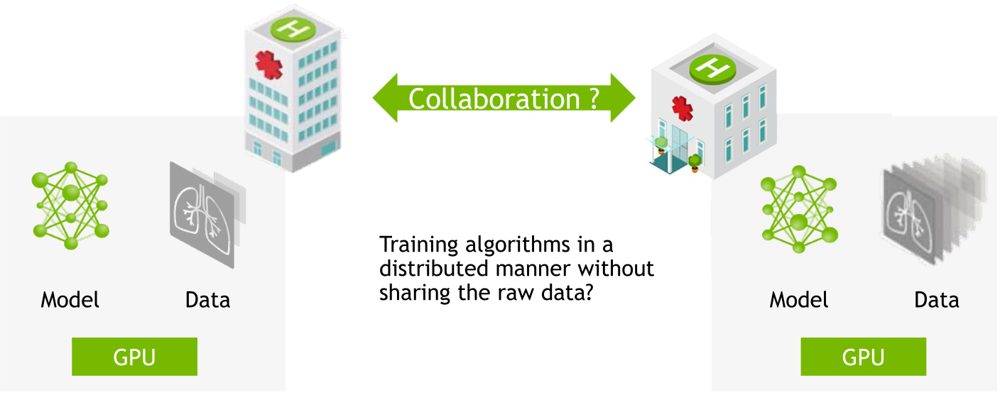]

Possible Solution:
.alert[.bold[Federated Learning] – learning paradigm that allows to integrate knowledge learned from non co-located data that resides within the participating entities into a global machine learning model.]

.footnote[Credit: Nicola Rieke | Sr. Deep Learning Solution Architect - Healthcare - FEDERATED LEARNING USING CLARA TRAIN.]

---

class: middle

# Paradigm Shift

.center.width-100[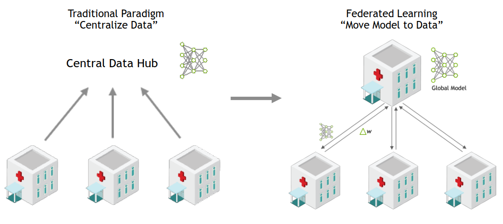]

.bold.center[Federated Learning]
.grid[
.kol-1-2[
- Enhanced data privacy and security
- Raw data never leaves the device
]
.kol-1-2[
- Improved model performance and diversity
- Scalability and efficiency]
]

.footnote[Credit: NVIDIA Deep Learning Institute.]

---

class: middle

.bold.larger-x[The future of digital health with federated learning]

.grid[
.kol-1-2[
.smaller-x[Positioning Federated Learning (FL) for Healthcare

- Сonsensus view on FL in healthcare
- Benefits  and impact of FL for medical applications
- Key challenges of implementing FL 
]
]

.kol-1-2[
.center.width-105[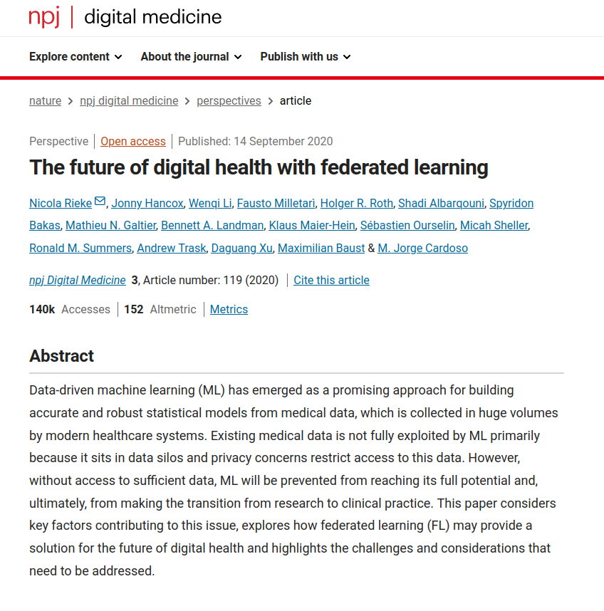]
]]

.footnote[Credit: [Rieke, N., Hancox, J., Li, W., Milletari, F., Roth, H. R., Albarqouni, S., ... & Cardoso, M. J. (2020). The future of digital health with federated learning. NPJ digital medicine, 3(1), 119](https://www.nature.com/articles/s41746-020-00323-1).]

---

class: blue-slide, middle, center
count: false

.larger-xxx[Why we need FL?]

---

class: middle,

## Data is the Key to Generalizable, Robust AI Models 

$$\text{Decentralized AI} = \text{federated compute} + \text{decentralized data, model}$$

.grid[
.kol-1-3[ 
.center.width-70[]
.bold.center[Regulations]

.smaller-x.center[Health data is highly sensitive, subject to regulations and
cannot easily be shared.]

]

.kol-1-3[ 
.center.width-70[]
.bold.center[Data Availability]

.smaller-x.center[More data in private domain than public. Distributed data cross-country, rare data siloed and sparsely distributed.]
  ]

.kol-1-3[
 
.center.width-80[]
.bold.center[Preserve Privacy]

.smaller-x.center[Leveraging private data while preserving data privacy is the mission of .bold[federated learning].]

]]

.footnote[Credit: NVIDIA Deep Learning Institute.]

---

.smaller-x[Real-world medical AI development needs .bold[external validation, multiple institutions, prospective data]. Among 500+ published medical AI studies, only 6% of have external validation. Few included multiple institutions.] 

.center.width-65[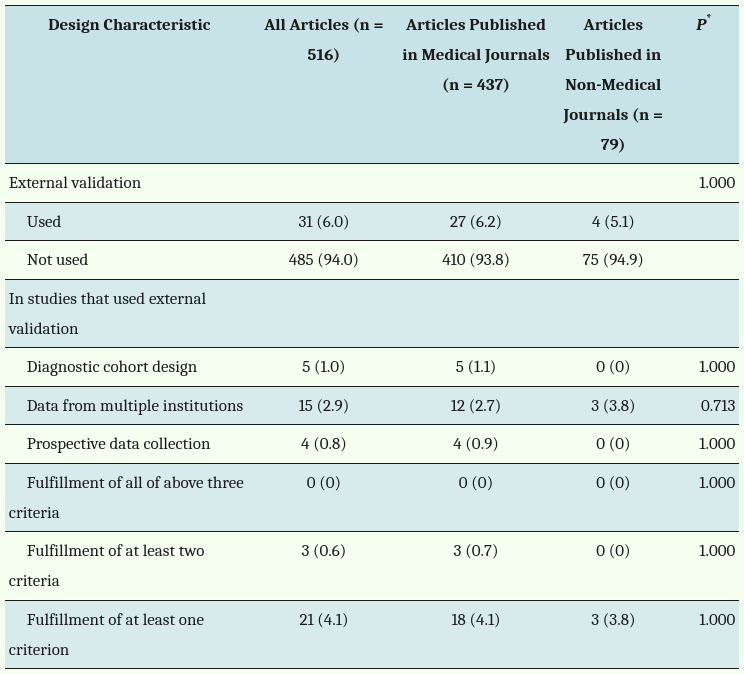]
.bold[Challenges: data sharing, regulation, legal, privacy, technical …]

.footnote[Credit: [Kim DW, Jang HY, Kim KW, Shin Y, Park SH. Design Characteristics of Studies Reporting the Performance of Artificial Intelligence Algorithms for Diagnostic Analysis of Medical Images: Results from Recently Published Papers](https://pmc.ncbi.nlm.nih.gov/articles/PMC6389801/), 2019.]

---

class: middle

.bold.larger-x[Separation of clinical data and compute]

.center.width-60[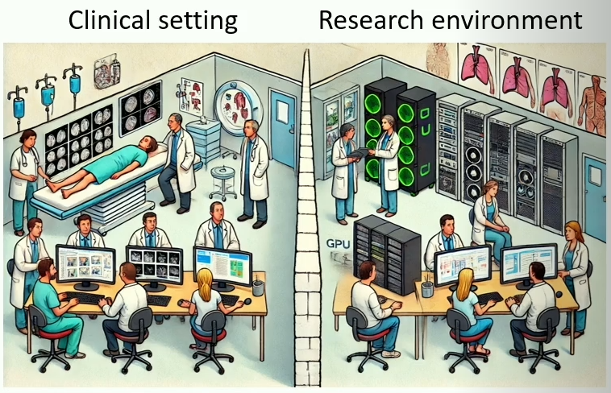]

- Compute clusters typically operate outside Protected Health Information (PHI) compliant environments, limiting direct access to medical data.
- Secure, compliant environments often have limited compute resources.
- Strict firewalls and security measures complicate connecting to federated learning servers. 

.footnote[Credit: John Garrett.Federated Learning in Medical Imaging: Enhancing Data Privacy and Advancing Healthcare, 2025.]

---

class: blue-slide, middle, center
count: false

.larger-xxx[How does FL work?]

---

background-image: url(./figures/lec1/Communication-Architectures.png)
background-size: contain

# Communication Architectures

.footnote[Credit: Nicola Rieke | Sr. Deep Learning Solution Architect - Healthcare - FEDERATED LEARNING USING CLARA TRAIN.]

---

background-image: url(./figures/lec1/clients.png)
background-size: contain

.bold.larger-x[Server-Client Federated Learning: Averaging]

       
       
.smaller-x[$n_k$ is the number of local data samples at client $k$;  
$n$ is the total number of samples across all participating clients;  
$w_t^k$ &mdash; model weights trained locally by client $k$;  
$t$ is a communication round. ]

.footnote[Credit: Nicola Rieke | Sr. Deep Learning Solution Architect - Healthcare - FEDERATED LEARNING USING CLARA TRAIN.]

---

class: middle

.bold.larger-x[Server-Client Federated Learning]

- .bold[Server:] manages job lifecycle, assigns computation tasks to clients & aggregate.
- .bold[Clients:] perform tasks assigned by the server.
- .bold[Workflow:] a distributed workflow with specific optimization algorithms and communication strategies.

.center.width-85[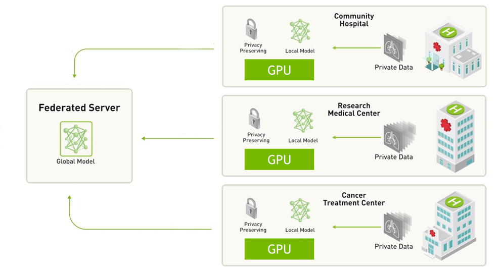]

.footnote[Credit: Nicola Rieke | Sr. Deep Learning Solution Architect - Healthcare - FEDERATED LEARNING USING CLARA TRAIN.]

---

background-image: url(./figures/lec1/high-level.png)
background-size: contain

# High-level implementation

.footnote[Credit: Nicola Rieke | Sr. Deep Learning Solution Architect - Healthcare - FEDERATED LEARNING USING CLARA TRAIN.]

---

class: blue-slide, middle, center
count: false

.larger-xxx[Data harmonization challenges for FL]

---

- .bold[Protocol and equipment variability]
  - Differences in imaging methods and machines between institutions.

.footnote[Credit: John Garrett.Federated Learning in Medical Imaging: Enhancing Data Privacy and Advancing Healthcare, 2025.]

---

count: false

- .inactive[.bold[Protocol and equipment variability]]
  - .inactive[Differences in imaging methods and machines between institutions.]
- .bold[Data interoperability]
  - Using common formats and processing methods for easier analysis.
  - In medical imaging DICOM standard is widespred, though clinical data such as labs is less standardized.

.footnote[Credit: John Garrett.Federated Learning in Medical Imaging: Enhancing Data Privacy and Advancing Healthcare, 2025.]

---

count: false

- .inactive[.bold[Protocol and equipment variability]]
  - .inactive[Differences in imaging methods and machines between institutions.]
- .inactive[.bold[Data interoperability]]
  - .inactive[Using common formats and processing methods for easier analysis.]
  - .inactive[In medical imaging DICOM standard is widespred, though clinical data such as labs is less standardized.]
- .bold[Labeling differences]
  - Inconsistent terminology and labels are used across different organizations.

.footnote[Credit: John Garrett.Federated Learning in Medical Imaging: Enhancing Data Privacy and Advancing Healthcare, 2025.]

---

class: blue-slide, middle, center
count: false

.larger-xxx[Large-scale standardized dataset (MedMNIST)]

---

background-image: url(./figures/lec1/overview.jpg)
background-size: contain

.smaller-xx[The .bold[MedMNIST] dataset consists of .highlight[12 datasets for 2D] and .highlight[6 datasets for 3D]. Covers key medical imaging modalities (.highlight[X-Ray, OCT, Ultrasound, CT, Electron Microscopy]). Supports tasks (.highlight[binary/multi-class classification, ordinal regression, multi-label]), and scales from .highlight[$10^2$] to .highlight[$10^5$] samples. Multiple size options: .highlight[28 (MNIST-Like)], .highlight[64], .highlight[128], and .highlight[224].]

       
           

.  
.

.footnote[Credit: [MedMNIST. 18x Standardized Datasets for 2D and 3D Biomedical Image Classification with Multiple Size Options: 28 (MNIST-Like), 64, 128, and 224](https://medmnist.com/), 2020.]

---

background-image: url(./figures/lec1/MedMNIST2D.png)
background-size: contain

.footnote[Credit: [MedMNIST. 18x Standardized Datasets for 2D and 3D Biomedical Image Classification with Multiple Size Options: 28 (MNIST-Like), 64, 128, and 224](https://medmnist.com/), 2020.]

---

background-image: url(./figures/lec1/MedMNIST3D.png)
background-size: contain

.footnote[Credit: [MedMNIST. 18x Standardized Datasets for 2D and 3D Biomedical Image Classification with Multiple Size Options: 28 (MNIST-Like), 64, 128, and 224](https://medmnist.com/), 2020.]

---

background-image: url(./figures/lec1/Benchmarking-MedMNIST2D.png)
background-size: contain

.footnote[Credit: [MedMNIST. 18x Standardized Datasets for 2D and 3D Biomedical Image Classification with Multiple Size Options: 28 (MNIST-Like), 64, 128, and 224](https://medmnist.com/), 2020.]

---

background-image: url(./figures/lec1/Benchmarking-MedMNIST3D.png)
background-size: contain

.footnote[Credit: [MedMNIST. 18x Standardized Datasets for 2D and 3D Biomedical Image Classification with Multiple Size Options: 28 (MNIST-Like), 64, 128, and 224](https://medmnist.com/), 2020.]

---

background-image: url(./figures/lec1/benchmark.png)
background-size: contain

.footnote[Credit: [Rethinking model prototyping through the MedMNIST+ dataset collection](https://github.com/sdoerrich97/rethinking-model-prototyping-MedMNISTPlus?tab=readme-ov-file), 2025.]

---

class: blue-slide, middle, center
count: false

.larger-xxx[Future directions for FL in Healthcare]

---

class: middle

.bold.larger-x[Real time updates to clinical models]

.center.width-50[]

.alert[Today basically all imaging AI models deployed and used clinically are static.]

.success[Though there's a need to work with the FDA, federated learning may soon facilitate real time refinement and updates of deployed models.]

.footnote[Credit: John Garrett.Federated Learning in Medical Imaging: Enhancing Data Privacy and Advancing Healthcare, 2025.]

---

class: end-slide, center
count: false

.larger-xxxx[🏁]

